Custom Midi Controller
======================

Code and instructions to easily build a MIDI Controller from scratch using a
standalone Atmega328P-PU, but still use the Arduino library for the convenient 
functions.

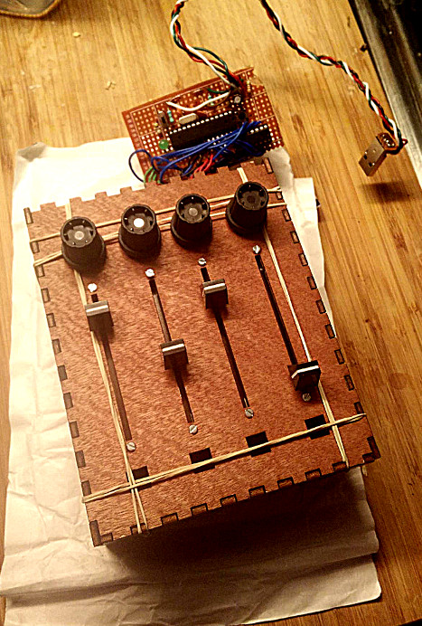

Features
--------

- **Cheap to build** : use directly a standalone Atmega microcontroller (not a whole Arduino board) ;
- **Plug-and-play** : detected as an actual MIDI device automatically (no need for intermediate software) ;
- **Easy reprogram through USB** : using the proper bootloader and a switch, you enter a mode to reprogram it at will (no need for USB to Serial  / FTDI stuff) ;
- **Use the Arduino library** to manage pins with pinMode, digitalRead, analogRead... *Please no crazy batshit using binary operators - who actually wants to code like that, really ?*
- **Easily customizable, extandable**.

How to build your MIDI Controller ?
-----------------------------------

1. [General overview](#overview)
2. [Shopping for hardware](#shopping)
3. [Making a USB cable](#cable)
4. [Building the core (standalone Atmega on USB)](#core)
5. [Flashing the USBasp/V-USB bootloader](#bootloader)
6. [Testing with a simple Midi Controller firmware](#test)
7. [Adding switches and potentiometer](#pots)
8. [(Optionnal) Add multiplexers](#mux)
9. [Put all this in a nice case](#case)
10. [Profit !](#profit)

<a name="overview"></a>
1. General overview
-------------------

The general architecture is shown below. The core of the controller is an Atmega
chip. A special bootloader is used to allow the chip to be reprogrammed directly
through USB. The user program can also communicate with the computer directly 
through USB, and actually be recognized as any USB device you would like,
including HID (Human Interface Device), and in our case, a MIDI controller. You
can then interface your controller with any music software speaking MIDI.

On the Atmega chip, potentiometers and switches can be connected, and mapped in 
the software to generate corresponding MIDI signals (control, notes, play/pause, 
...). 

Note that the Atmega alone accepts only 6 analog entries (i.e. needed to interface 
potentiometers). However it is relatively simple to add one or several
multiplexers to extend the capabilities (8 entries mapped to 1 entry, i.e. up to 
48 analog entries).

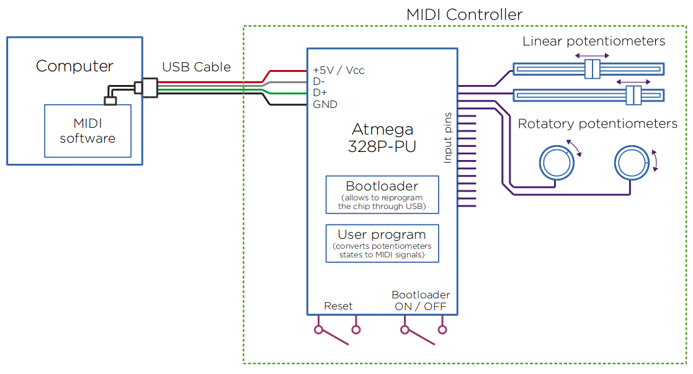

<a name="shopping"></a>
2. Shopping for hardware
------------------------

### The core

- 1 × Atmega328P-PU                ([Product on Farnell](http://fr.farnell.com/webapp/wcs/stores/servlet/Search?exaMfpn=true&mfpn=1715487)) Careful : need *exactly* the 328**P-PU** version
- 1 × Socket for 28 pin chip       ([Product on Farnell](http://fr.farnell.com/webapp/wcs/stores/servlet/Search?exaMfpn=true&mfpn=2445626)) Optionnal, but recommended
- 1 × USB connector                ([Product on Farnell](http://fr.farnell.com/webapp/wcs/stores/servlet/Search?exaMfpn=true&mfpn=1696544)) (or an old USB cable with male plug, to be cut to access the wires)
- 1 × 12MHz crystal                ([Product on Farnell](http://fr.farnell.com/webapp/wcs/stores/servlet/Search?exaMfpn=true&mfpn=2508453))
- 2 × 3.6V zener diode             ([Example on Farnell](http://fr.farnell.com/webapp/wcs/stores/servlet/Search?exaMfpn=true&mfpn=1861480))
- 2 × 22pF ceramic capacitor       ([Example on Farnell](http://fr.farnell.com/webapp/wcs/stores/servlet/Search?exaMfpn=true&mfpn=9411674))
- 1 × 100nF ceramic capacitor      ([Example on Farnell](http://fr.farnell.com/webapp/wcs/stores/servlet/Search?exaMfpn=true&mfpn=9411887))
- 1 × 4.7μF electrolytic capacitor ([Example on Farnell](http://fr.farnell.com/webapp/wcs/stores/servlet/Search?exaMfpn=true&mfpn=9451471))
- 1 × 10~50kΩ resistor             ([Example on Farnell](http://fr.farnell.com/webapp/wcs/stores/servlet/Search?exaMfpn=true&mfpn=2329609))
- 1 × 1~2kΩ resistor               ([Example on Farnell](http://fr.farnell.com/webapp/wcs/stores/servlet/Search?exaMfpn=true&mfpn=2329629))
- 2 × 68Ω resistor                 ([Example on Farnell](http://fr.farnell.com/webapp/wcs/stores/servlet/Search?exaMfpn=true&mfpn=2329701))
- 1 × mini push button switch      ([Example on Farnell](http://fr.farnell.com/webapp/wcs/stores/servlet/Search?exaMfpn=true&mfpn=2468762))
- 1 × mini toggle switch           ([Example on Farnell](http://fr.farnell.com/webapp/wcs/stores/servlet/Search?exaMfpn=true&mfpn=2320018))

- Some colored wires such as [this](http://www.robotshop.com/eu/en/elenco-22-gauge-black-25-ft.html), or any wire you can find. Just don't use fancy jumper wires if you intend to solder !
- Single-sided prototyping board ([example](http://www.robotshop.com/eu/en/prototyping-board.html)), or a breadboard if you don't want to solder right away.

Total should be around 6€, the Atmega chip being the most expensive part.

### Actual controller stuff

Feel free to look for other potentiometers and switches ! Just make sure that
the knobs/caps you take are compatible with the potentiometers you choose. Also
make sure you know how you plan to fix them on your final box. I'm just showing 
those I took below. Total for rotatory pots was around 1.5€ each (including the 
knob). Linear pots were around 2€ each (including the cursor).

- On/off switches                        ([Example on Farnell](http://fr.farnell.com/webapp/wcs/stores/servlet/Search?exaMfpn=true&mfpn=9473378))
- Push-button / keys                     ([Example on Farnell](http://fr.farnell.com/webapp/wcs/stores/servlet/Search?exaMfpn=true&mfpn=2079605))
- Rotatory potentiometers                ([Product on Farnell](http://fr.farnell.com/webapp/wcs/stores/servlet/Search?exaMfpn=true&mfpn=1760794))
- Knob for rotatory potentiometers       ([Example on Farnell](http://fr.farnell.com/webapp/wcs/stores/servlet/Search?exaMfpn=true&mfpn=2473099))
- Linear potentiometers (sliders/faders) (Product on Farnell : [45mm](http://fr.farnell.com/webapp/wcs/stores/servlet/Search?exaMfpn=true&mfpn=1688415), [60mm](http://fr.farnell.com/webapp/wcs/stores/servlet/Search?exaMfpn=true&mfpn=1688411))
- Cursor for linear potentiometers       ([Product on Farnell](http://fr.farnell.com/webapp/wcs/stores/servlet/Search?exaMfpn=true&mfpn=1440016))
- 100 screws for linear potentiomeneters ([Product on Farnell](http://fr.farnell.com/webapp/wcs/stores/servlet/Search?exaMfpn=true&mfpn=507118))

Total for 4 rotatory, 4 linear and 4 push-buttons is around 15~20€.

### Tools

- A soldering iron (and some solder material) ;
- A stripper ;
- Some scissors or small cutters to cut wire excess after soldering ;
- Ideally, a multimeter - or anything to at least something to check there's no short between GND and 5V !
- A small knife if you need to remove the chip from the support.

### Optional - Analog multiplexers (if you aim to control more than 6 analog entries) :

These will allow you to map 8 analog inputs to 1 input

- 1-to-8 analog multiplexer         ([Product on Farnell](http://fr.farnell.com/webapp/wcs/stores/servlet/Search?exaMfpn=true&mfpn=1236279))
- Socket for 16 pin chip            ([Product on Farnell](http://fr.farnell.com/webapp/wcs/stores/servlet/Search?exaMfpn=true&mfpn=2445622)) Optionnal, but recommended

<a name="cable"></a>
3. Making a USB cable
---------------------

The first step is to build ourselves a USB cable. This will be the interface
between the computer and our MIDI controller, and in particular the Atmega chip.

There are many ways to do this. For instance, you can cut an old USB cable (e.g.
from a broken USB mouse) to access the wires. You can also just solder a male or 
female connector directly on the board next to your Atmega, and use a cable like 
[this](http://fr.farnell.com/productimages/standard/en_US/95W0184-40.jpg).
Personnally I built a cable using a male USB connector and some wires. Make sure
you wires are at least ~0.5m long (mines were 20 cm long and it's clearly too short :))

The pinning of the A plug is shown below. It is good practice to use red/black
for the 5V/GND pins , and white/green for the D-/D+ pins.

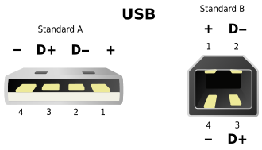


<a name="core"></a>
4. Building the core (standalone Atmega on USB)
-----------------------------------------------

The core of the controller is heavily based on the [USnooBie kit](http://eleccelerator.com/usnoobie/index.php).
The design of the kit allows a Atmega to communicate and be reprogrammed
directly through USB, and, if you want to, to be recognized as an actual USB 
device of your choice. It's also relatively cheap (you may build one for 5-6€).
On the other hand, it doesn't give you an easy access to i/o pins like the
Arduino does with its headers numbered 1 to 13. I also don't know yet how to
get an equivalent of the Serial library for debugging purposes.

The design is centered on an Atmega328P-PU, and a few parts to ensure good 
operation of the chip and working USB communication. Here are the major stuff :

- Capacitors to mitigate fluctuation on the power supply (5V / GND) ;
- 12 MHz crystal (and two 22pF friends) as an external clock for the chip ;
- 3.6V zener diodes and a few resistors for the USB data lines to work properly ;
- A reset switch to reboot the Atmega when needed ;
- A bootloader switch to choose between bootloader/reprogram mode, or "use current program" mode ;
- (Optionnal) A led to show the board is powered on.

More details on the role of each components can be found on the 
[USnooBie assembly page](http://eleccelerator.com/usnoobie/assembly.php).
You might also be interested in keeping the [Atmega pin map](./doc/pinsAtmega328.png) 
around, it's always handy at some point.

PLEASE NOTE that I did not include any protection in my design. It's essentially
because the board is not meant to have any 9V around that could inadvertently
damage the USB ports it's plugged in. There's still a risk of short between GND
and 5V on your board. However I found out from experience that my laptop's USB 
ports were not damaged because of such shorts - the kernel was just unhappy for
a few minutes, then it was working again.

It's a good practice, though, to check after any change in the board, that
there's at least no short between 5V and GND before plugging the controller back
in your laptop. You can do that with the "beep mode" of a multimeter. Ideally, 
you should also check for instance that the total resistance between, e.g. the 
D+ and D- pins, directly on the back of the USB connector, and the corresponding 
pins on the chip socket, is around 68Ω (I had 65, good enough). More generally, 
you can do some continuity checks (the "beep" thing) between the various component 
legs and pins  that should be connected together, to remove suspicions about 
solders being bad and so on.

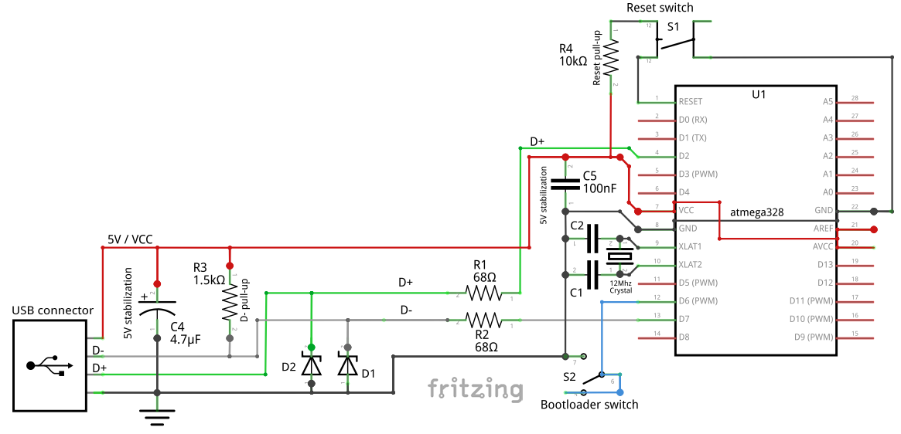

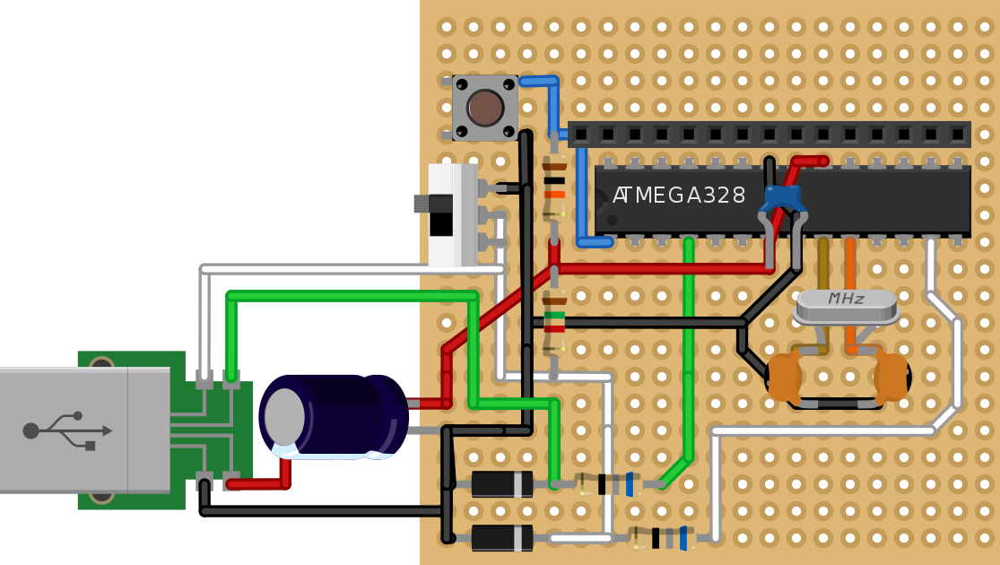

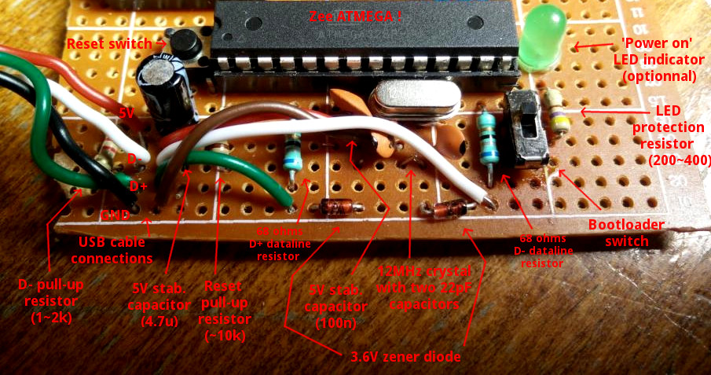

<a name="bootloader"></a>
5. Flashing the USBasp/V-USB bootloader
---------------------------------------

For the Atmega to be able to communicate directly through the USB (allowing it
to be recognized as a USB device and to reprogram it at will), we use a custom
bootloader from V-USB. The bootloader is the small piece of software, pretty
similar to the BIOS in computer, which initiates the rest of the software meant
to be run. 

In our case, if the "bootloader switch" is activated when the Atmega boot, it will
emulate a "USBasp" programmer and you'll be able to upload to change the program. 
If the "bootloader switch" is in the other position, the bootloader will launch
the program you uploaded on the Atmega - which can be as simple as blinking a LED,
or acting as a USB device (mouse, keyboard, MIDI, ...).

Flashing the bootloader is a sort of egg-and-chicken situation : to flash the
chip for the first time, you need another chip. This can be done for instance
using a Arduino UNO board. Fortunately, this is done once and for all, assuming 
the flashing is succesful ! The bootloader flashing setup is the following :

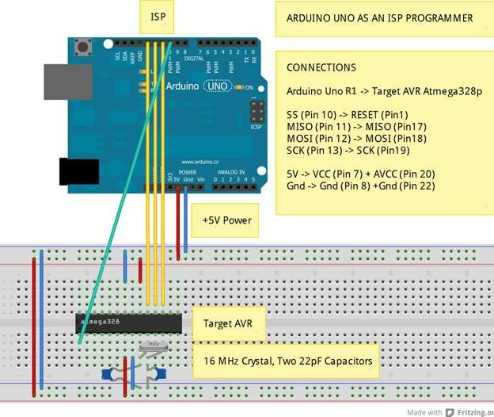

Once this setup is ready, you should flash a particular program "ArduinoISP"
(in-situ programming) on the Arduino board. It is available in the Arduino IDE
under File > Examples. Then you need to switch the Programmer in the IDE to
"Arduino as ISP" (Tools > Programmer > Arduino as ISP).

If we wanted to flash the regular Arduino bootloader, we would now go to Tools >
Flash bootloader. However, we want to flash our particular V-USB bootloader.
Therefore, we use the Makefile in this directory to do so :

```
# Compile
make bootloader
# Flash
make bootloader-flash
```

Once this is done, you should put back your Atmega on your board and test if it
worked. To do so, you can set your board in "Bootloader mode ON". In a terminal,
type :

```
dmesg -e -w
```

to display new messages from the kernel. Plug your board in. If it's working,
you should see some blabbling about a new USB device called USBasp (meaning it's
recognized as a USB chip programmer).

<a name="test"></a>
6. Testing with a simple Midi Controller firmware
--------------------------------------------

Now you might want to flash a simple / test firmware to see your device being a
MIDI controller. To do so, you might want to add a small switch for instance on
pin 13 of your Atmega (the other pin of the switch goes to GND). You might want
to add a pull-up resistor (something between 10k and 50k should do the trick)
between pin 13 and VCC (see 'Switches' in next section).

Then, edit the `setup()` and `loop()` of the `main.cpp` to something like this :

```
void setup()
{
    midiController.initUSB();
    midiController.mapPinToNote(13, 60);
}

void loop()
{
    midiController.update();
    delay(10);
}
```

In this example, we map what's on pin 13 to the note 60 ("Middle C", or C5 in 
music notation). (The full map of MIDI notes can be found for instance
[here](http://www.electronics.dit.ie/staff/tscarff/Music_technology/midi/midi_note_numbers_for_octaves.htm)).

Compile the code using `make hex`, then upload it using `make upload` ! If
compiling and uploading worked, you can flip the bootloader switch to the other
position, such that the device now use the program you just flashed. Reboot or
replug the board. In `dmesg -e -w`, you should now see the board being
recognized as some sort of 'CustomMidiController'. Try `amidi -l` to confirm
that the OS correctly sees it as a MIDI controller. Then try `amidi -p hw:1,0,0
-d` to listen to incoming MIDI signals. Now if you press the switch on pin 13,
it should emit a MIDI signal that you can see on your computer.

<a name="pots"></a>
7. Adding switches and potentiometers
-------------------------------------

Next step is to add as many switches and potentiometers as you'd like (modulo
the fact that you'll need multiplexing if you want more than 6 potentiometers).
Each time you add a new element, you should a corresponding line in your
`setup()` in `main.cpp` :

```C++
// For a 'key' 
// SOME_NOTE_NUMBER designates the music note you want
midiController.mapPinToNote(SOME_PIN_NUMBER, SOME_NOTE_NUMBER);
// For a control (knobs / faders).
// SOME_CONTROL_NUMBER is just an identifier you choose, starting at 0
midiController.mapPinToControl(SOME_OTHER_PIN_NUMBER, SOME_CONTROL_NUMBER);
```

### Linear potentiometer ([datasheet](http://www.farnell.com/datasheets/1874874.pdf))

Look for the « 1 », « 2 » and « 3 » numbers near the pins of the potentiometer.

- Pin 1 goes to 5V ;
- Pin 2 (the signal) goes to the analog input of your choice ;
- Pin 3 goes to GND.

### Rotatory potentiometer ([datasheet](http://www.farnell.com/datasheets/90780.pdf))

The pin mapping is the following :

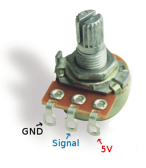

### Switches

For the switches (any types), you'll probably need to add a pull-up resistor,
which yields a schematic like this :

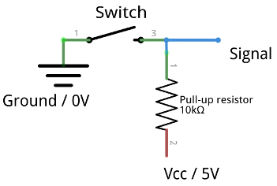


<a name="mux"></a>
8. (Optionnal) Add multiplexers
-------------------------------

<a name="case"></a>
9. Put all this in a nice case
------------------------------

[MakerCase](http://www.makercase.com/)

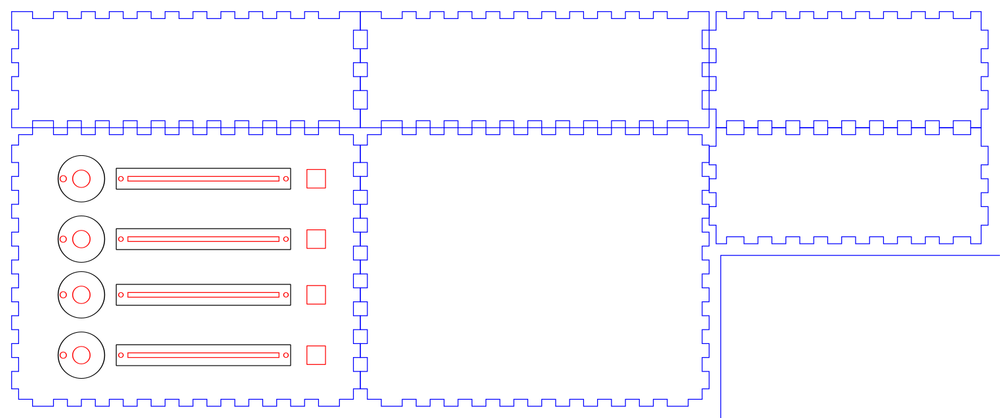

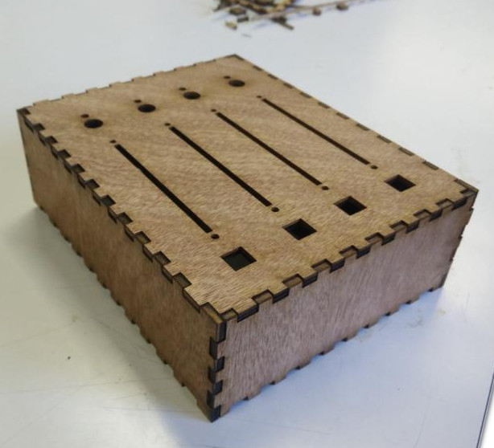

<a name="profit"></a>
10. Profit !
-----------


Programming using the Arduino IDE
---------------------------------

Haven't tested this already !

Instructions are available on this [USnooBie kit page](http://eleccelerator.com/usnoobie/arduino.php), 
regarding how to program the core board with the Arduino IDE. In the context of
this MIDI Controller, you will also need to include the MIDI USB lib thing
somehow.

References, inspiration, credits, links
---------------------------------------

- USBaspLoader https://github.com/baerwolf/USBaspLoader
- V-USB https://www.obdev.at/products/vusb/index.html

- USnooBie kit http://www.eleccelerator.com/usnoobie/index.php
- More on USnooBie kit http://wiki.seeedstudio.com/wiki/Usnoobie_Kit

- http://www.instructables.com/id/Custom-Arduino-MIDI-Controller/?ALLSTEPS
- http://www.instructables.com/id/USB-MIDI-Controller/?ALLSTEPS

- http://codeandlife.com/2012/01/22/avr-attiny-usb-tutorial-part-1/

